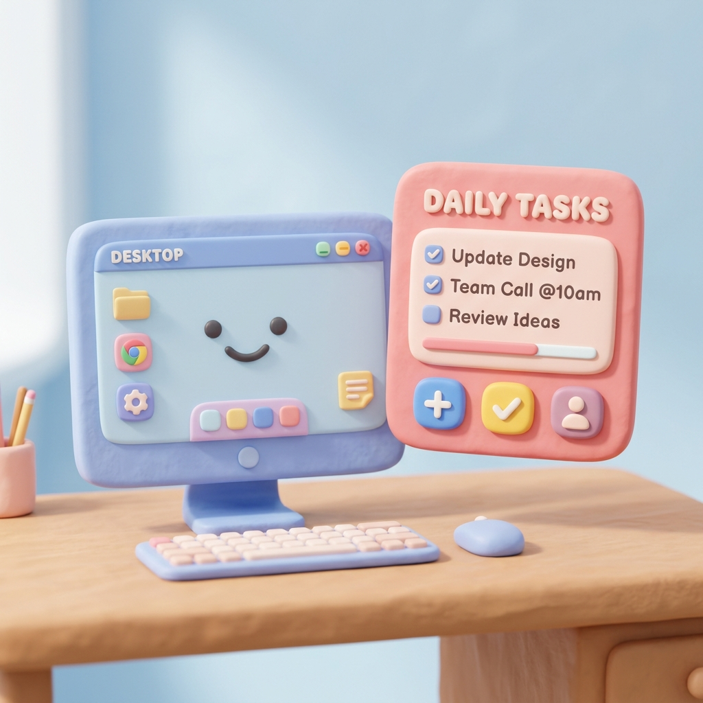

<div align="center">
  

  # 🧸 Lemihandle: Spatial Intent Engine

  **An AI-powered OS overlay featuring a soft, claymorphic UI that lets you intuitively control your computer using spatial gestures and voice.**

  [](https://field-pod-86986136.figma.site)

  [](https://www.python.org/downloads/)
  [](https://fastapi.tiangolo.com/)
  [](https://riverbankcomputing.com/software/pyqt/)
</div>

---

## 🌐 Official Website
Check out our interactive product showcase and documentation at:
👉 **[Lemihandle Official Site](https://field-pod-86986136.figma.site)**

---

## 🚀 Overview

**Lemihandle** is an intelligent, friendly assistant that gently sits on top of your Windows desktop. It watches your hands and face through your webcam, listens to your voice, and uses Google's multimodal **Gemini 2.5 Flash Lite** AI to instantly execute your intentions based on what is currently on your screen.

With its soft, **claymorphism-inspired design**, Lemihandle replaces robotic, rigid interfaces with playful, pill-shaped overlays and smooth, matte visuals. No clicking. No typing. Just point, speak, and command.

---

## 🎯 Features

- 🖖 **Gesture Tracking:** Uses Google MediaPipe to track hand and face gestures in real-time.
  - **Pinch:** Instantly triggers an AI analysis of your current screen.
  - **Open Palm:** Acts as a push-to-talk button for your microphone.
  - **Closed Fist:** Submits your audio command (or gently dismisses the current UI).
  - **Head Nod:** A 2-step confirmation to execute an action.
- 🗣️ **Local Voice Transcription:** Captures audio through `sounddevice` and transcribes it instantly.
- 🧠 **Multimodal AI Brain:** A `FastAPI` backend orchestrates communication with the Gemini API.
- 🎨 **Claymorphic UI:** A beautiful, soft-edged PyQt5 overlay that renders AI responses as smooth, floating clay cards on your desktop. No harsh glass or neon lines—just friendly, tactile aesthetics.

---

## 🏗️ Architecture: Two decoupled microservices. One brain.

The project is split into two perfectly decoupled microservices to ensure the UI remains buttery-smooth while the AI inference happens quietly in the background.

```text
Lemihandle/
├── frontend/                  # The PyQt5 + MediaPipe Overlay (Spatial Overlay)
│   ├── main.py                # Core application entry point
│   ├── overlay.py             # Claymorphic floating GUI
│   ├── gesture_engine.py      # Camera & tracking thread
│   ├── audio_engine.py        # Push-to-talk mic & recognition
│   └── network.py             # Asynchronous JSON payload transmitter
│
├── backend/                   # The FastAPI AI Brain (Intent Brain)
│   ├── main.py                # FastAPI server & multimodal pipelines
│   ├── ai_agent.py            # Gemini 2.5 Flash Lite interaction
│   └── tools.py               # Pluggable local tools (shell, browser, files)
└── assets/                    # Soft claymorphism images
```

---

## ⚙️ Setup & Installation

### The 1-Click Method (Windows)
The easiest way to install and run the engine is by using the included startup script.

1. Double-click `start.bat` in the root folder.
2. The script will automatically:
   - Create an isolated Python virtual environment (`venv`).
   - Install all required backend and frontend dependencies.
   - Generate a default `backend\.env` file.
3. Open `backend\.env` in any text editor and paste your **Google Gemini API Key**.
4. Double-click `start.bat` again! It will launch the FastAPI backend in the background and start the soft UI overlay.

---

## 👥 Contributors

This project was brought to life by the collaboration of two specialized developers:

- **Frontend & Spatial Overlay:** [@Firex-007](https://github.com/Firex-007)
  - *Responsible for the PyQt5 claymorphic UI, MediaPipe worker threads, and gesture recognition.*
- **Backend & Intent Brain:** [@StarDust-Git-Code](https://github.com/StarDust-Git-Code)
  - *Responsible for the FastAPI orchestration, multimodal Gemini integration, and pluggable system tools.*

---

## 🤝 Contributing
Built with ❤️ using Python, PyQt5, MediaPipe, and Gemini. Pull requests are highly encouraged—just make sure your UI contributions stick to the soft, playful claymorphism design language!

## 📜 License
MIT License
